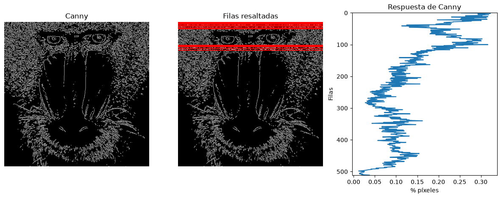
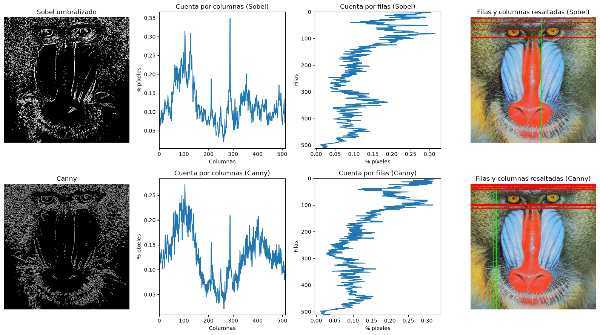
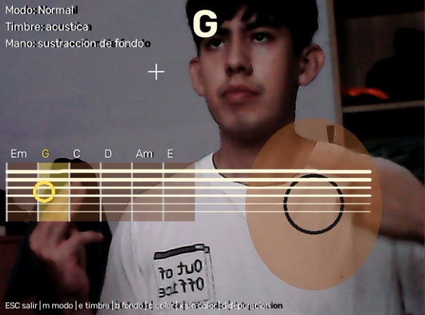

# Práctica 2. Funciones básicas de OpenCV

**Autor:** Joel Morera Apaza
**Asignatura:** Visión por Computador

### Contenidos

- [Requisitos y ejecución](#requisitos-y-ejecución)
- [Tarea 1. Cuenta de píxeles blancos por filas (Canny)](#tarea-1-cuenta-de-píxeles-blancos-por-filas-canny)
- [Tarea 2. Sobel umbralizado y comparación con Canny](#tarea-2-sobel-umbralizado-y-comparación-con-canny)
- [Tarea 3. Demostrador: *Virtual Air Guitar* reinterpretado](#tarea-3-demostrador-virtual-air-guitar-reinterpretado)

Todas las tareas están resueltas en el cuaderno [`VC_P2.ipynb`](VC_P2.ipynb) y usan la imagen `mandril.jpg`.

---

## Requisitos y ejecución

Se usa el mismo *environment* de la práctica 1 (OpenCV, NumPy y Matplotlib), además de Pillow:

```
pip install opencv-python numpy matplotlib Pillow
```

Hay que ejecutar las celdas en orden: la segunda celda carga la imagen, la convierte a grises y calcula los contornos de Canny que usan las tareas 1 y 2. El demostrador de la tarea 3 necesita una **webcam**. El sonido se reproduce con `winsound`, incluido en Python para Windows; en otros sistemas el demostrador funciona igual, pero sin sonido.

---

## Tarea 1. Cuenta de píxeles blancos por filas (Canny)

> Realiza la cuenta de píxeles blancos por filas (en lugar de por columnas). Determina el valor máximo de píxeles blancos para filas, *maxfil*, mostrando el número de filas y sus respectivas posiciones, con un número de píxeles blancos mayor o igual que 0.90·*maxfil*. Resalta con alguna primitiva gráfica en la imagen de Canny las filas que cumplen dicha condición.

Con `cv2.reduce` (dimensión 1, `REDUCE_SUM`) se suman los valores de cada fila de la imagen de Canny. Después se divide entre `255 * ancho` para obtener la fracción de píxeles blancos de cada fila. Las filas que alcanzan al menos el 90 % del máximo se marcan con `cv2.line` en rojo sobre la imagen de Canny.

**Resultado:**

- *maxfil* = 0,322 (el 32,2 % de los píxeles de la fila son borde)
- 20 filas cumplen la condición: 1–8, 12, 15, 20, 21, 23, 24, 82, 84, 86, 88, 94 y 100



Las filas seleccionadas se concentran en dos franjas: el pelo de la frente (parte superior) y la zona de los ojos, que son las regiones con más textura de la imagen.

---

## Tarea 2. Sobel umbralizado y comparación con Canny

> Aplica umbralizado a la imagen resultante de Sobel (convertida a 8 bits), y posteriormente realiza el conteo por filas y columnas similar al realizado en el ejemplo con la salida de Canny de píxeles no nulos. Calcula el valor máximo de la cuenta por filas y columnas, y determina las filas y columnas por encima del 0.90·máximo. Remarca con alguna primitiva gráfica dichas filas y columnas sobre la imagen del mandril. ¿Cómo se comparan los resultados obtenidos a partir de Sobel y Canny?

Pasos:

1. Suavizado gaussiano (3×3) de la imagen en grises y cálculo de Sobel en x e y, combinados con `cv2.add`, como en el ejemplo del cuaderno.
2. Conversión a 8 bits con `cv2.convertScaleAbs` y umbralizado binario con `cv2.threshold`. Se usa un umbral de **130**, con el que Sobel deja un 11,9 % de píxeles de borde, cerca del 12,7 % de Canny, para que la comparación sea justa.
3. Cuenta por filas y por columnas con `cv2.reduce`, tanto para Sobel como para Canny.
4. Selección de las filas y columnas que superan 0,90·máximo, marcadas sobre el mandril: **columnas en verde** y **filas en rojo**.

| | Sobel umbralizado | Canny |
|---|---|---|
| Píxeles de borde | 11,9 % | 12,7 % |
| Máximo por columnas | 0,350 | 0,271 |
| Columnas seleccionadas | 288 | 92, 104, 105 |
| Máximo por filas | 0,314 | 0,322 |
| Filas seleccionadas | 3, 4, 20, 51, 81, 82, 83 (7) | 1–8, 12, 15, 20, 21, 23, 24, 82, 84, 86, 88, 94, 100 (20) |



### ¿Cómo se comparan?

- **Coinciden en lo global.** Los perfiles por filas tienen la misma forma: la mayor densidad de bordes está en la frente (filas 0–25) y en los ojos (filas ~80–100), y la mínima en el centro del hocico. Varias filas seleccionadas coinciden (3, 4, 20, 82–83).
- **En columnas difieren.** Sobel selecciona solo la columna 288, el contorno vertical muy contrastado entre el hocico rojo y la mejilla azul. Canny también tiene un pico ahí, pero no llega al 90 %, y selecciona las columnas 92, 104 y 105, junto al ojo izquierdo, donde hay mucha textura fina de pelo.
- **Sobel da bordes gruesos y depende mucho del umbral.** Es solo la derivada umbralizada, así que un borde fuerte produce varios píxeles contiguos (por eso aparecen filas consecutivas, 81–83). Con un umbral de 50, el 41 % de la imagen queda marcada como borde. Además, al combinar las derivadas con `cv2.add` se suman con signo: donde tienen signos opuestos se cancelan y se pierden los bordes de una de las diagonales, por lo que la imagen parece iluminada desde una esquina.
- **Canny da bordes finos y continuos.** Aunque parte del gradiente de Sobel, adelgaza los bordes a 1 píxel y usa histéresis con dos umbrales para conectar los tramos débiles con los fuertes. Detecta bordes en todas las orientaciones, recoge mejor la textura del pelo y reparte más las filas seleccionadas (20 frente a 7).

**En resumen:** Sobel umbralizado resalta sobre todo los contornos de mayor contraste, con trazos gruesos, y su resultado cambia mucho con el umbral. Canny ofrece contornos más finos y completos.

---

## Tarea 3. Demostrador: *Virtual Air Guitar* reinterpretado

> Tras ver los vídeos *My little piece of privacy*, *Messa di voce* y *Virtual air guitar*, proponer un demostrador reinterpretando la parte de procesamiento de la imagen, tomando como punto de partida alguna de dichas instalaciones.

### Punto de partida

En la [*Virtual Air Guitar*](https://youtu.be/FIAmyoEpV5c?feature=shared) original, el músico lleva guantes naranjas. La cámara localiza las manos por su color, la distancia entre ellas elige la nota y el gesto de la mano derecha dispara el rasgueo.

### Reinterpretación

Se mantiene la idea de tocar una guitarra que no existe, pero el procesamiento se replantea usando solo funciones vistas en las prácticas 1 y 2, y **sin necesidad de guantes**:

| Elemento | Técnica |
|---|---|
| **Guitarra virtual** | Mástil con 6 trastes (acordes Em, G, C, D, Am, E) y cuerpo dibujados sobre la imagen en espejo. |
| **Mano del mástil → acorde** | Sustracción de fondo con `createBackgroundSubtractorMOG2`. El fondo se aprende al inicio y se congela (`learningRate=0`) para que la mano quieta no pase a formar parte del fondo. En la franja del mástil se cuentan los píxeles de primer plano por columna con `cv2.reduce`, como en la tarea 1. La mano es el extremo izquierdo de las columnas ocupadas. |
| **Modo guante** (opcional) | Con la tecla `c` se calibra el color de un guante u objeto (mediana HSV de un recuadro), y la mano pasa a segmentarse con `cv2.inRange` en HSV, como en la instalación original. |
| **Mano de la púa → rasgueo** | Diferencia entre fotogramas consecutivos (`cv2.absdiff` + `cv2.threshold`) en la zona del cuerpo. Si la fracción de píxeles en movimiento supera un umbral, suena el acorde. El sentido del rasgueo (arriba o abajo) se obtiene del desplazamiento del centroide de la cuenta por filas, y cada cambio de sentido cuenta como un nuevo rasgueo. |
| **Sonido** | Sintetizado con NumPy mediante el algoritmo de cuerda pulsada **Karplus-Strong**, sin muestras grabadas. Las cuerdas entran con unos milisegundos de desfase según el sentido del rasgueo, y el timbre eléctrico se obtiene con una saturación `tanh`. Se precalculan 24 sonidos (6 acordes × 2 sentidos × 2 timbres). |
| **Salida visual** | Cuerdas que vibran como una onda estacionaria amortiguada, un destello con el color del acorde y tres modos: *Normal*, *Neón* (contornos de Canny) y *Silueta* (primer plano de MOG2). |

### Resultado



Demostrador en modo *Normal* con timbre acústico. La mano izquierda está sobre el segundo traste del mástil, así que se selecciona el acorde **G** (traste resaltado y círculo amarillo en la posición detectada de la mano). La mano derecha acaba de rasguear sobre el cuerpo de la guitarra, y por eso las cuerdas aparecen iluminadas.

Cada traste representa un acorde completo: no se detectan los dedos por separado, sino la posición de la mano, como en la instalación original, donde la nota la elige la distancia entre las manos. Reconocer la forma real de cada acorde exigiría localizar los dedos uno a uno (por ejemplo, con los *landmarks* de MediaPipe Hands), algo que queda fuera de las técnicas de las prácticas 1 y 2.

### Uso

1. Ejecuta la celda de síntesis de sonidos y después la del demostrador.
2. Al arrancar, mantén los brazos fuera de la franja del mástil mientras se aprende el fondo (unos 2 s).
3. Coloca la mano izquierda sobre el mástil (a la izquierda de la imagen) para elegir el acorde, y mueve la mano derecha arriba y abajo sobre el cuerpo de la guitarra para rasguear.

| Tecla | Acción |
|---|---|
| `ESC` | Salir |
| `m` | Cambiar modo visual (Normal / Neón / Silueta) |
| `e` | Alternar guitarra acústica / eléctrica |
| `b` | Volver a aprender el fondo |
| `c` | Calibrar el color del guante (3 s para colocarlo en el recuadro) |
| `x` | Dejar el color y volver a la sustracción de fondo |
| `d` | Depuración: perfil por columnas, nivel de movimiento y máscaras |

---

Bajo licencia de Creative Commons Reconocimiento - No Comercial 4.0 Internacional
